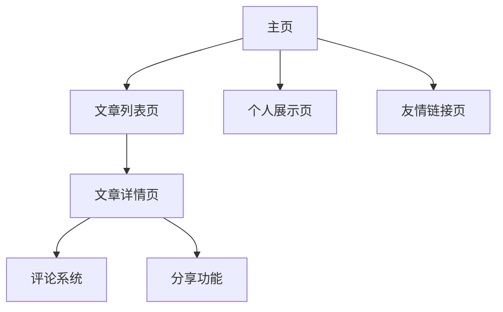

# 个人博客网站产品需求文档

## 1. 产品概述

本项目旨在打造一个符合国际审美标准的现代化个人技术博客网站，采用极简主义设计理念，为技术博主提供优质的内容展示平台。

产品主要解决技术博主内容展示、读者阅读体验和个人品牌建设的需求，目标用户为技术博主和技术内容读者。

产品目标是成为具有国际化视野的专业技术博客平台，提升个人技术影响力。

## 2. 核心功能

### 2.1 用户角色

| 角色 | 注册方式 | 核心权限 |
|------|----------|----------|
| 博主 | 管理员创建 | 发布文章、管理内容、回复评论 |
| 访客 | 无需注册 | 浏览文章、搜索内容、发表评论 |

### 2.2 功能模块

我们的个人博客网站包含以下主要页面：

1. **主页**：导航栏、搜索功能、文章列表、个人介绍、页脚
2. **文章列表页**：文章展示、分页功能、搜索筛选、分类标签
3. **文章详情页**：文章内容、评论系统、分享功能、文章导航
4. **个人展示页**：个人简介、项目展示、技能标签云、成长时间线
5. **友情链接页**：友链列表、交流合作信息

### 2.3 页面详情

| 页面名称 | 模块名称 | 功能描述 |
|----------|----------|----------|
| 主页 | 导航栏 | 展示网站logo、主要页面链接（首页、关于、文章、联系） |
| 主页 | 搜索功能 | 支持文章标题、内容、标签的全文搜索 |
| 主页 | 文章列表 | 展示最新文章，支持按分类、标签、时间排序 |
| 主页 | 个人介绍 | 展示个人信息、技能、经历等核心信息 |
| 主页 | 页脚 | 包含社交媒体图标、版权信息 |
| 文章列表页 | 文章展示 | 展示所有文章，支持多种排序方式 |
| 文章列表页 | 分页功能 | 支持分页加载，提升页面性能 |
| 文章列表页 | 搜索筛选 | 在文章列表中进行搜索和筛选 |
| 文章列表页 | 分类标签 | 展示所有分类标签，支持点击筛选 |
| 文章详情页 | 文章内容 | 展示文章标题、发布时间、分类标签、详细内容 |
| 文章详情页 | 评论系统 | 支持用户评论和回复，包括游客评论 |
| 文章详情页 | 分享功能 | 提供社交媒体分享按钮 |
| 文章详情页 | 文章导航 | 支持大纲功能、上下篇文章切换 |
| 个人展示页 | 个人简介 | 展示技能、经历、联系方式 |
| 个人展示页 | 项目展示 | GitHub项目、作品集展示 |
| 个人展示页 | 技能标签云 | 可视化展示技术栈 |
| 个人展示页 | 成长时间线 | 技术成长轨迹展示 |
| 友情链接页 | 友链列表 | 展示其他博客作者的链接，促进交流合作 |

## 3. 核心流程

**访客流程：**
访客进入主页 → 浏览文章列表 → 点击感兴趣的文章 → 阅读文章详情 → 发表评论或分享 → 浏览其他相关文章

**博主流程：**
博主登录后台 → 创建新文章 → 编辑文章内容 → 设置分类标签 → 发布文章 → 回复读者评论 → 管理网站内容

## 4. 用户界面设计

### 4.1 设计风格

- **主色调**：温暖白色背景(#FAFAFA)、浅灰色辅助(#F5F5F5)
- **文字颜色**：深灰色(#333333)确保良好对比度
- **强调色**：现代深蓝色(#2563eb)作为品牌色
- **按钮样式**：圆角扁平化设计，悬停时微妙阴影效果
- **字体**：系统字体栈，主要内容16px，标题采用渐进式大小
- **布局风格**：卡片式布局，大量留白，顶部导航固定
- **图标风格**：使用Lucide图标库，线性风格保持一致性

### 4.2 页面设计概览

| 页面名称 | 模块名称 | UI元素 |
|----------|----------|--------|
| 主页 | 导航栏 | 固定顶部，白色背景，阴影分割，logo左对齐，导航链接右对齐 |
| 主页 | 文章列表 | 卡片式布局，白色背景，圆角8px，悬停时轻微上浮效果 |
| 主页 | 侧边栏 | 个人头像圆形，简介文字灰色，标签云彩色标签 |
| 文章详情页 | 文章内容 | 最大宽度限制，行高1.6，代码块深色背景 |
| 文章详情页 | 评论区 | 嵌套回复设计，头像+用户名+时间布局 |
| 个人展示页 | 技能标签云 | 不同大小的彩色标签，悬停时放大效果 |

### 4.3 响应式设计

产品采用移动优先的响应式设计策略，支持桌面、平板、手机三种主要设备。在移动端优化触摸交互，侧边栏在小屏幕下收起为抽屉式菜单。