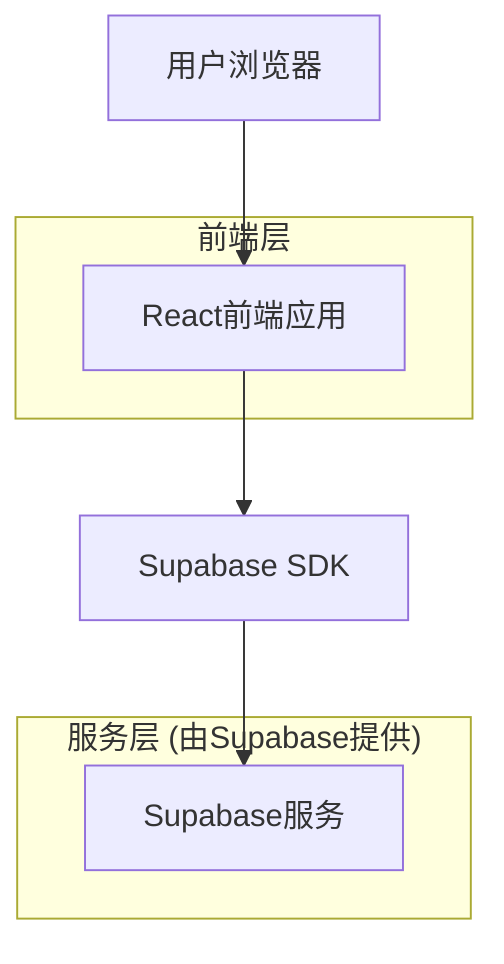
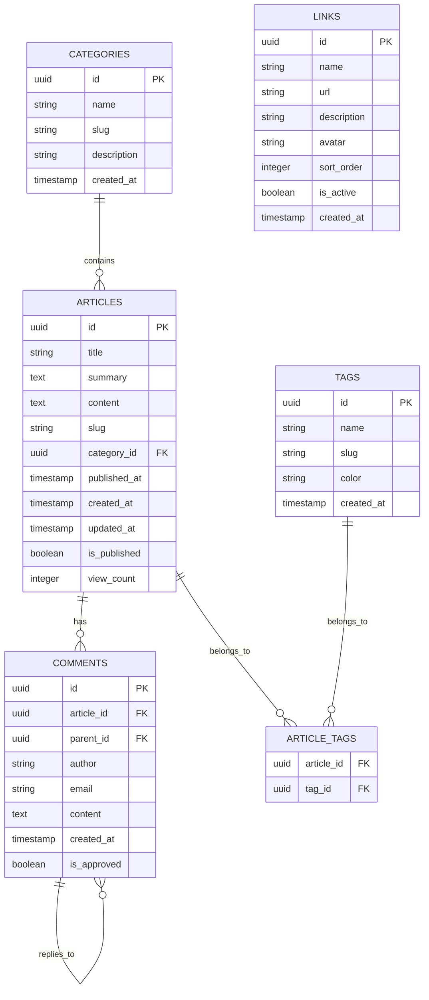

# 个人博客网站技术架构文档

## 1. 架构设计



## 2. 技术描述

- 前端：React@18 + TailwindCSS@3 + Vite
- 后端：Supabase (PostgreSQL数据库 + 认证 + 存储)
- 部署：Vercel (前端) + Supabase (后端服务)

## 3. 路由定义

| 路由 | 用途 |
|------|------|
| / | 主页，展示最新文章列表和个人介绍 |
| /articles | 文章列表页，展示所有文章并支持筛选 |
| /articles/:id | 文章详情页，展示具体文章内容和评论 |
| /about | 个人展示页，展示技能、项目和成长轨迹 |
| /links | 友情链接页，展示合作伙伴链接 |
| /admin | 管理后台，博主管理文章和评论 |

## 4. API定义

### 4.1 核心API

文章管理相关
```
GET /api/articles
```

请求参数：
| 参数名 | 参数类型 | 是否必需 | 描述 |
|--------|----------|----------|------|
| page | number | false | 页码，默认为1 |
| limit | number | false | 每页数量，默认为10 |
| category | string | false | 分类筛选 |
| tag | string | false | 标签筛选 |

响应：
| 参数名 | 参数类型 | 描述 |
|--------|----------|------|
| articles | Article[] | 文章列表 |
| total | number | 文章总数 |
| hasMore | boolean | 是否有更多文章 |

示例：
```json
{
  "articles": [
    {
      "id": "1",
      "title": "React Hooks 最佳实践",
      "summary": "深入探讨React Hooks的使用技巧...",
      "content": "...",
      "publishedAt": "2024-01-15T10:00:00Z",
      "category": "前端开发",
      "tags": ["React", "JavaScript"]
    }
  ],
  "total": 50,
  "hasMore": true
}
```

评论管理相关
```
POST /api/comments
```

请求：
| 参数名 | 参数类型 | 是否必需 | 描述 |
|--------|----------|----------|------|
| articleId | string | true | 文章ID |
| content | string | true | 评论内容 |
| author | string | true | 评论者姓名 |
| email | string | false | 评论者邮箱 |
| parentId | string | false | 父评论ID（回复时使用） |

响应：
| 参数名 | 参数类型 | 描述 |
|--------|----------|------|
| success | boolean | 操作是否成功 |
| comment | Comment | 创建的评论对象 |

## 5. 数据模型

### 5.1 数据模型定义



### 5.2 数据定义语言

文章表 (articles)
```sql
-- 创建表
CREATE TABLE articles (
    id UUID PRIMARY KEY DEFAULT gen_random_uuid(),
    title VARCHAR(255) NOT NULL,
    summary TEXT,
    content TEXT NOT NULL,
    slug VARCHAR(255) UNIQUE NOT NULL,
    category_id UUID REFERENCES categories(id),
    published_at TIMESTAMP WITH TIME ZONE,
    created_at TIMESTAMP WITH TIME ZONE DEFAULT NOW(),
    updated_at TIMESTAMP WITH TIME ZONE DEFAULT NOW(),
    is_published BOOLEAN DEFAULT false,
    view_count INTEGER DEFAULT 0
);

-- 创建索引
CREATE INDEX idx_articles_published_at ON articles(published_at DESC);
CREATE INDEX idx_articles_category_id ON articles(category_id);
CREATE INDEX idx_articles_slug ON articles(slug);

-- 权限设置
GRANT SELECT ON articles TO anon;
GRANT ALL PRIVILEGES ON articles TO authenticated;
```

分类表 (categories)
```sql
CREATE TABLE categories (
    id UUID PRIMARY KEY DEFAULT gen_random_uuid(),
    name VARCHAR(100) NOT NULL,
    slug VARCHAR(100) UNIQUE NOT NULL,
    description TEXT,
    created_at TIMESTAMP WITH TIME ZONE DEFAULT NOW()
);

GRANT SELECT ON categories TO anon;
GRANT ALL PRIVILEGES ON categories TO authenticated;
```

标签表 (tags)
```sql
CREATE TABLE tags (
    id UUID PRIMARY KEY DEFAULT gen_random_uuid(),
    name VARCHAR(50) NOT NULL,
    slug VARCHAR(50) UNIQUE NOT NULL,
    color VARCHAR(7) DEFAULT '#3B82F6',
    created_at TIMESTAMP WITH TIME ZONE DEFAULT NOW()
);

GRANT SELECT ON tags TO anon;
GRANT ALL PRIVILEGES ON tags TO authenticated;
```

文章标签关联表 (article_tags)
```sql
CREATE TABLE article_tags (
    article_id UUID REFERENCES articles(id) ON DELETE CASCADE,
    tag_id UUID REFERENCES tags(id) ON DELETE CASCADE,
    PRIMARY KEY (article_id, tag_id)
);

GRANT SELECT ON article_tags TO anon;
GRANT ALL PRIVILEGES ON article_tags TO authenticated;
```

评论表 (comments)
```sql
CREATE TABLE comments (
    id UUID PRIMARY KEY DEFAULT gen_random_uuid(),
    article_id UUID REFERENCES articles(id) ON DELETE CASCADE,
    parent_id UUID REFERENCES comments(id) ON DELETE CASCADE,
    author VARCHAR(100) NOT NULL,
    email VARCHAR(255),
    content TEXT NOT NULL,
    created_at TIMESTAMP WITH TIME ZONE DEFAULT NOW(),
    is_approved BOOLEAN DEFAULT true
);

CREATE INDEX idx_comments_article_id ON comments(article_id);
CREATE INDEX idx_comments_created_at ON comments(created_at DESC);

GRANT SELECT ON comments TO anon;
GRANT ALL PRIVILEGES ON comments TO authenticated;
```

友情链接表 (links)
```sql
CREATE TABLE links (
    id UUID PRIMARY KEY DEFAULT gen_random_uuid(),
    name VARCHAR(100) NOT NULL,
    url VARCHAR(255) NOT NULL,
    description TEXT,
    avatar VARCHAR(255),
    sort_order INTEGER DEFAULT 0,
    is_active BOOLEAN DEFAULT true,
    created_at TIMESTAMP WITH TIME ZONE DEFAULT NOW()
);

CREATE INDEX idx_links_sort_order ON links(sort_order);

GRANT SELECT ON links TO anon;
GRANT ALL PRIVILEGES ON links TO authenticated;

-- 初始化数据
INSERT INTO categories (name, slug, description) VALUES
('前端开发', 'frontend', 'React、Vue、JavaScript等前端技术'),
('后端开发', 'backend', 'Node.js、Python、数据库等后端技术'),
('工具分享', 'tools', '开发工具、效率工具推荐');

INSERT INTO tags (name, slug, color) VALUES
('React', 'react', '#61DAFB'),
('JavaScript', 'javascript', '#F7DF1E'),
('TypeScript', 'typescript', '#3178C6'),
('Node.js', 'nodejs', '#339933'),
('CSS', 'css', '#1572B6');
```